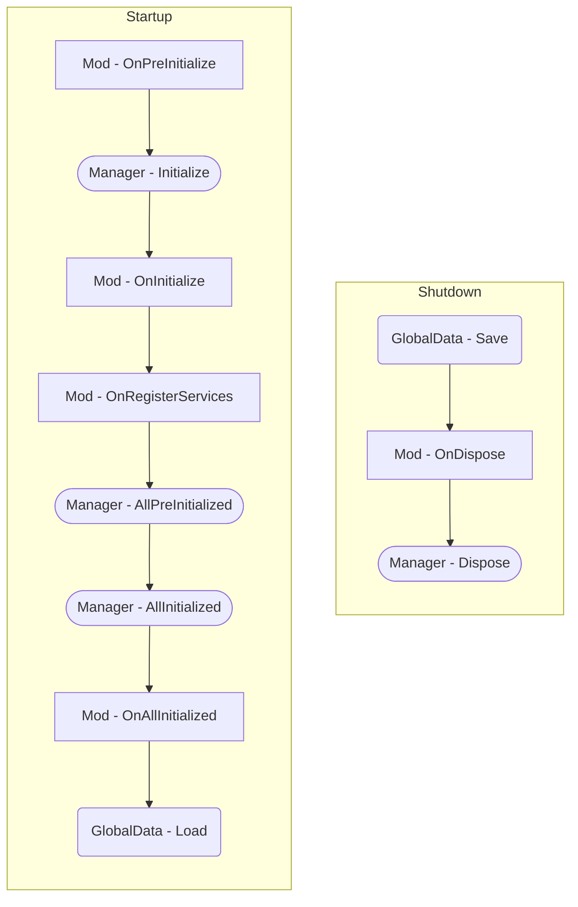

# Order of Execution

A mod's core event methods are called at the same time as the game manager's core events, so this chart shows the order in which they are called

---

```mermaid
graph LR
    A[Mod - OnPreInitialize]
    B([Manager - Initialize])
    C[Mod - OnInitialize]
    D[Mod - OnRegisterServices]
    E([Manager - AllPreInitialized])
    F([Manager - AllInitialized])
    G[Mod - OnAllInitialized]
    H(GlobalData - Load)
    X(GlobalData - Save)
    Y[Mod - OnDispose]
    Z([Manager - Dispose])

    subgraph Startup
    A-->B
    B-->C
    C-->D
    D-->E
    E-->F
    F-->G
    G-->H
    end
    subgraph Shutdown
    X-->Y
    Y-->Z
    end
    Startup~~~Shutdown
```